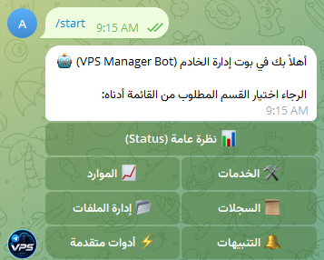
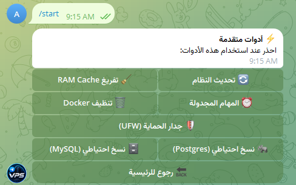

<div align="center">
  
  <h1>VPS Manager Bot 🤖</h1>
  <p><strong>Your Ultimate Server Command Center over Telegram</strong></p>
  
  <p>
    
    
    
    
  </p>
</div>

---

## 📖 Overview (نبذة عامة)

**VPS Manager Bot** is a highly secure, advanced Telegram bot built with Node.js and TypeScript, designed to act as a full-fledged command center for your Linux server. Manage files, monitor resources, execute commands, and receive instant security alerts directly from your Telegram app.

بوت تيليجرام احترافي ومتقدم لإدارة خوادم اللينكس (VPS) ومراقبتها كلياً من خلال تطبيق تيليجرام. تم بناؤه باستخدام Node.js و TypeScript ليكون غرفة عمليات متكاملة وآمنة تماماً.

---

## ✨ Features (الميزات)

🚀 **Core Features:**
- 📊 **Live Dashboard & Charts:** View live system resources (CPU, RAM, Disk, Network) and generate beautiful donut charts (`/chart` & `/dashboard`).
- 💻 **Interactive Terminal (`/sh`):** Execute Linux shell commands natively directly from Telegram.
- 📂 **Interactive File Explorer:** Navigate directories and read files using smooth inline pagination buttons.
- 🐳 **Docker & PM2 Management:** Monitor, restart, and prune Docker containers and PM2 applications seamlessly.
- 🛡️ **Advanced Security (UFW & SSH):** Control your UFW Firewall visually. Get instant alerts on any new SSH login to your server.
- 📜 **Log Viewer:** Instantly fetch and read `Nginx`, `Auth`, and `Syslog` files.
- ⏰ **Cron & Auto-Healer:** View active cron jobs. The bot automatically attempts to restart crashed services (Nginx, PM2 apps).
- 🗄️ **Database Backups:** Command-based secure backups for MySQL and PostgreSQL.
- 🌐 **Uptime Monitor:** Automatically pings your configured websites every minute and alerts you if they go down.

---

## 🔒 Security First (الأمان)
- **Strict Authorization:** The bot ONLY responds to the `TELEGRAM_ADMIN_ID` configured in the `.env` file. All other users are blocked and ignored.
- **Path Restrictions:** File explorer operations are restricted to `ALLOWED_PATHS` configured by you.

---

## 🛠️ Installation & Setup (الإعداد والتشغيل)

### 1. Prerequisites (المتطلبات)
- Node.js (v18+)
- PM2 (for production deployment)
- Telegram Bot Token (from [@BotFather](https://t.me/BotFather))
- Your Telegram User ID (from [@userinfobot](https://t.me/userinfobot))

### 2. Clone & Install
```bash
git clone https://github.com/3bud-ZC/vps_bot.git
cd vps_bot
npm install
```

### 3. Environment Variables (المتغيرات البيئية)
```bash
cp .env.example .env
```
Edit the `.env` file:
```ini
TELEGRAM_BOT_TOKEN="YOUR_BOT_TOKEN"
TELEGRAM_ADMIN_ID="YOUR_USER_ID"
ALERTS_ENABLED="true"
ALLOWED_PATHS="/var/www,/etc/nginx"
MONITOR_URLS="https://abud.fun,https://google.com"
```

### 4. Build & Run (البناء والتشغيل)
```bash
# For local development
npm run dev

# For Production (Build)
npm run build
pm2 start dist/index.js --name "vps-bot"
pm2 save
```

---

## 📸 Screenshots (صور من البوت)

<div align="center">
  
  
</div>

---

## 🤝 Contributing
Contributions, issues, and feature requests are welcome! Feel free to check the [issues page](https://github.com/3bud-ZC/vps_bot/issues).

## 📝 License
This project is [MIT](https://opensource.org/licenses/MIT) licensed.

---
<div align="center">
  <i>Developed with ❤️ by <a href="https://github.com/3bud-ZC">Abud</a></i>
</div>
